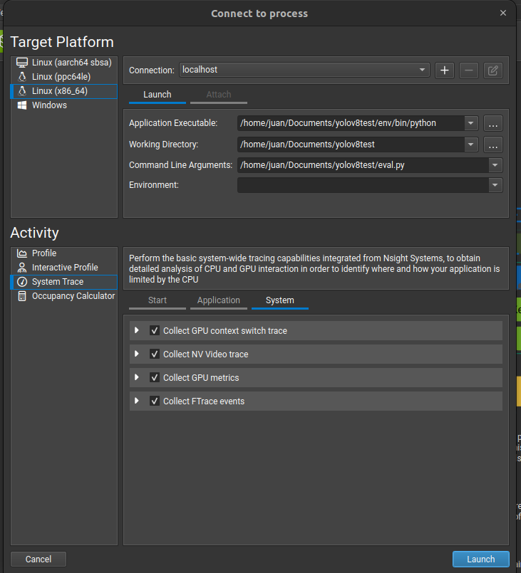
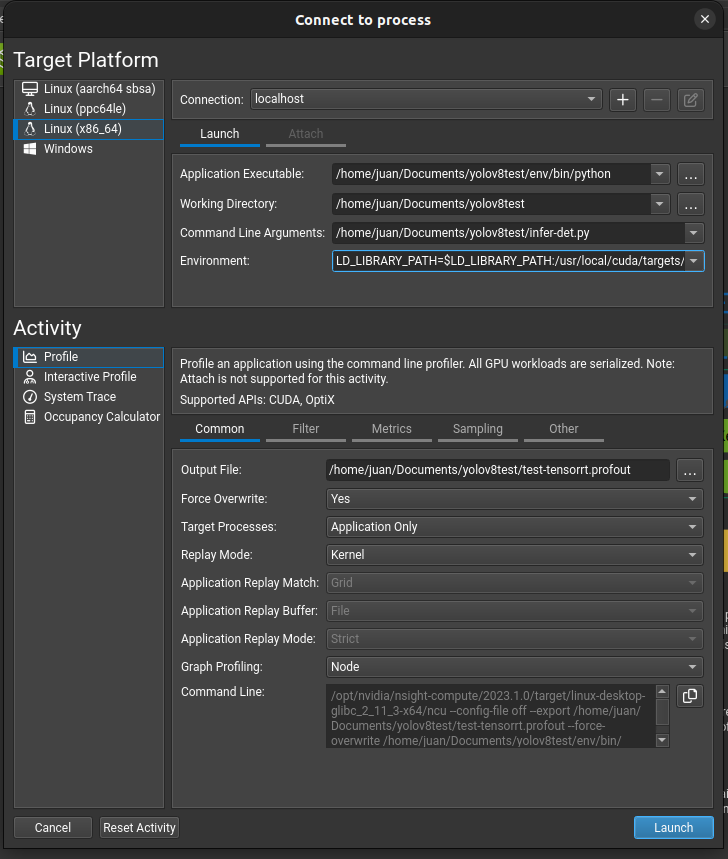

# Aprendiendo a usar profiling con Nvidia Nsight en Ubuntu 22.04

## red a probar: yolactV8
install yolactV8:

```
pip install ultralytics
```

para usar gpu installa dnvo torch:

para su torch personalizado: `https://pytorch.org/get-started/locally/`

```
pip uninstall torch
pip install --pre torch torchvision torchaudio --index-url https://download.pytorch.org/whl/nightly/cu118
```

para entrenar sigue los pasos aca presentes:

```
https://github.com/ultralytics/ultralytics/blob/main/docs/modes/train.md
```

dataset: en mi drive de la tesis
obs: no corre en windows :(


## Correr nvidia Nsight

descargamso nsight compute de la pagina oficial (.run)

instalamos con `chmod +x <archivo>` seguido de `sudo ./<archivo>`

lo agregamos al path de sudo (sin sudo no sirve de nada abrirlo)

```
sudo nano /root/.bashrc
```

al final de este archvo agregamos

```
export PATH=$PATH:/usr/local/NVIDIA-Nsight-Compute

```

donde `export PATH=$PATH:/usr/local/NVIDIA-Nsight-Compute` es la direccion donde se instalo nsight

ahora para iniciarlo como sudoer, en terminal inicia como sudoer `sudo -i`y aqui abres el programa con `ncu-ui`.

# Ejecutar python con nsight

Creamos un nuevo proyecto, donde debemos indicar:

* la direccon del ejecutable (python), en este caso, la direccion de python en el env creado usando virtualenv.

* la direccion del workspace (a este repo)

* el argumento sera el programa .py a ejecutar (en este caso el que corre la evaluacion de la red eval.py)

<div align="center">
      <a href="">
     
      </a>
</div>

finalmente corremos el system trace con lo que desamos ver (recuerde marcar la GPU).

# probar tensorRT version:

para esto es necesario tener instalado CUDA y CUDNN en el sistema, ademas de tensorRT, almenos en el env (usando pip)

revisar este repo: 

```
https://github.com/triple-Mu/YOLOv8-TensorRT
```

Es necesario indicar la libreria de cuddn para poder hacer el profile de la red usando tensorrt: 

``` 
LD_LIBRARY_PATH=$LD_LIBRARY_PATH:/usr/local/cuda/targets/x86_64-linux/lib/
```

<div align="center">
      <a href="">
     
      </a>
</div>

# Resultados dataset piedra papel o tijera

se obtienen al correr los codigos:

* no RT:
`python3 eval.py --weights='weights/best-yolo8n.pt' --imgs='datasets/data.yaml'`

* RT:
`python3 evalRT.py --engine='weights/best-yolo8n-fp16.engine' --imgs='datasets/data.yaml'`

obs: Time: average inference time per image
|   yolo8n    | size MB | Time ms | mAP50 | mAP50-95 |
|-------------|---------|---------|-------|----------|
| no RT       | 6.2     | 2.9     |0.958  |0.718     |
| fp32 (RT)   | 20.3    | 2.47    |1.0    |0.725     |
| fp16 (RT)   | 8.6     | 1.19    |0.997  |0.723     |

|   yolo8m    | size MB | Time ms | mAP50 | mAP50-95 |
|-------------|---------|---------|-------|----------|
| no RT       | 103.7   | 13.5    |0.964  |0.764     |
| fp32 (RT)     | 153.5   | 11.4    |0.997  |0.746   |
| fp16 (RT)   | 55.4    | 3.88    |0.997  |0.745     |


# REF

* YOLOv8 `https://github.com/ultralytics/ultralytics`
* TensorRT-YOLOv8 `https://github.com/triple-Mu/YOLOv8-TensorRT`
* Entendiendo TensorRT `https://medium.com/@abhaychaturvedi_72055/understanding-nvidias-tensorrt-for-deep-learning-model-optimization-dad3eb6b26d9`
